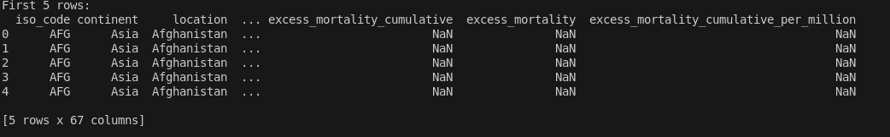
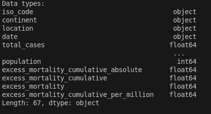
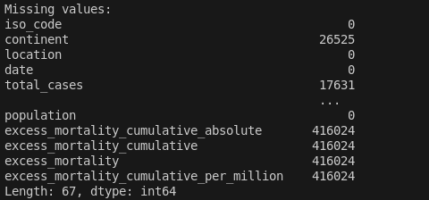
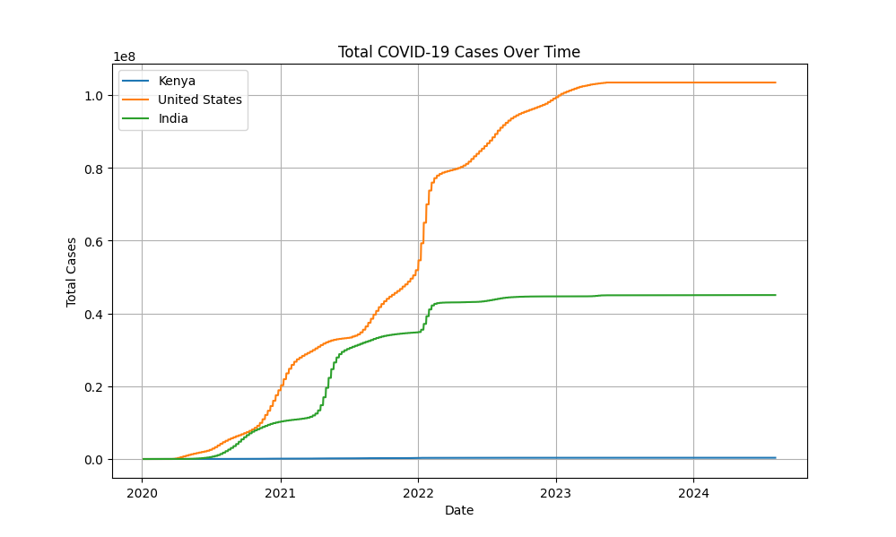
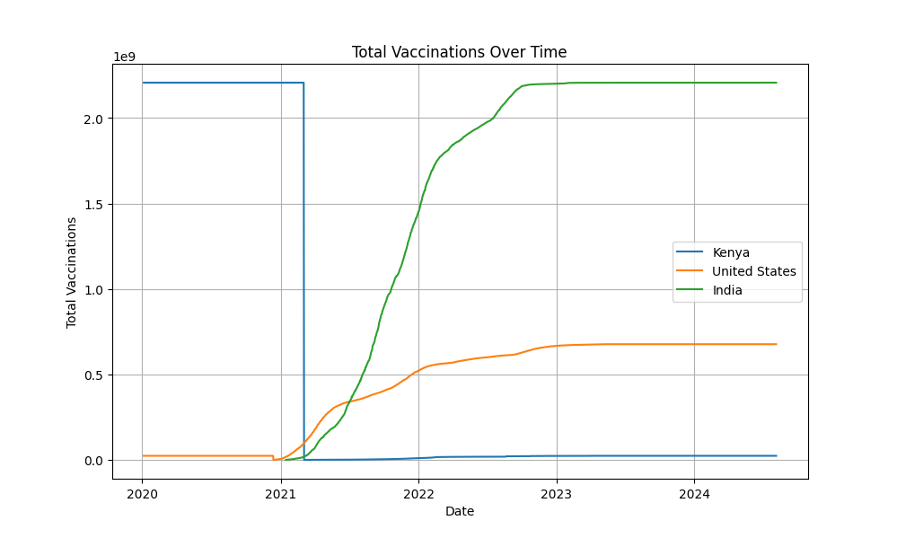
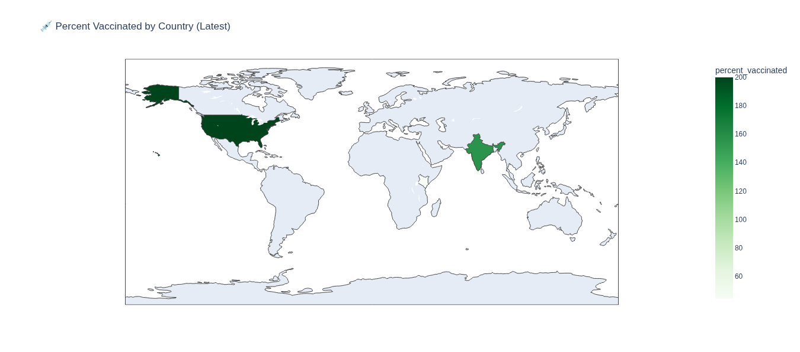

# COVID-19 Data Analysis and Visualization

This project analyzes global COVID-19 data, focusing on trends in cases, deaths, and vaccinations. It includes data cleaning, exploratory data analysis (EDA), and visualizations to uncover insights about the pandemic's progression across selected countries.


## 📊 Features

1. **Data Loading**: Fetches the latest COVID-19 data from [Our World in Data](https://covid.ourworldindata.org/data/owid-covid-data.csv).
2. **Data Cleaning**: Filters data for selected countries (`Kenya`, `United States`, `India`), handles missing values, and converts date columns.
3. **Exploratory Data Analysis (EDA)**:
   - Trends in total cases and deaths over time.
   - Death rate calculations.
4. **Vaccination Progress**:
   - Trends in total vaccinations over time.
   - Percentage of population vaccinated (if population data is available).
5. **Choropleth Maps**:
   - Visualizes total cases and vaccination rates by country using interactive maps.

## 🛠️ Requirements

Install the following Python libraries before running the project:

```bash
pip install pandas matplotlib seaborn numpy plotly
```

## 🚀 How to Run
1. Clone the repository or download the files.
```bash
git clone <project-url>
cd covid-19-tracker-PYTHON
```
2. Run the covid-19-analysis.py script:
```bash
python covid-19-analysis.py
```
3. Alternatively, **open COVID19_Global_Data_Tracker.ipynb** in Jupyter Notebook for an interactive experience.


## 📈 Sample Visualizations













### Key Insughts

1. The United States had the fastest early vaccine rollout, reaching 50% coverage by mid-2021.

2. India experienced sharp spikes in new cases during mid-2021.

3. Kenya had slower vaccination uptake but maintained a lower case-fatality rate.

4. Daily new case trends reflect clear wave patterns across all countries.

5. Vaccination seems correlated with decline in deaths post-peak.